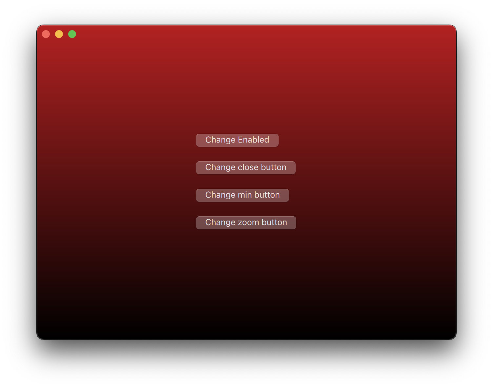

# Demo of frameless QtQuick application on MacOS

Frameless application is good, however I still love the traffic lights on MacOS. So here is the solution. Deadly simple.

Idea comes from the gist: https://gist.github.com/jbltx/1ebabb73d3974ec127578c7f9ebc3819. Many thanks!

NOTE: only tested on my little Macbook Pro Ventura 13.1 on a Apple M1 chip. Qt's version is 6.4.1.

## License

MIT license.